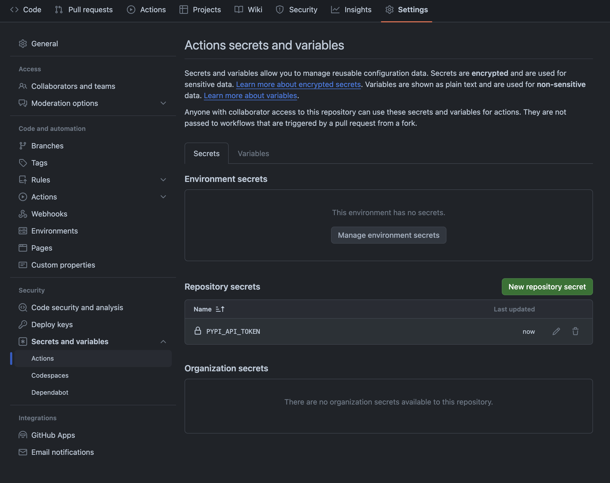

# Deploying to PyPI
In order to deploy changes made to this repository to PyPI, the PYPI_API_TOKEN secret must be set in the GitHub Actions configuration found [here](https://github.com/gt-sse-center/AutoRA-experiment-server/settings/secrets/actions).

