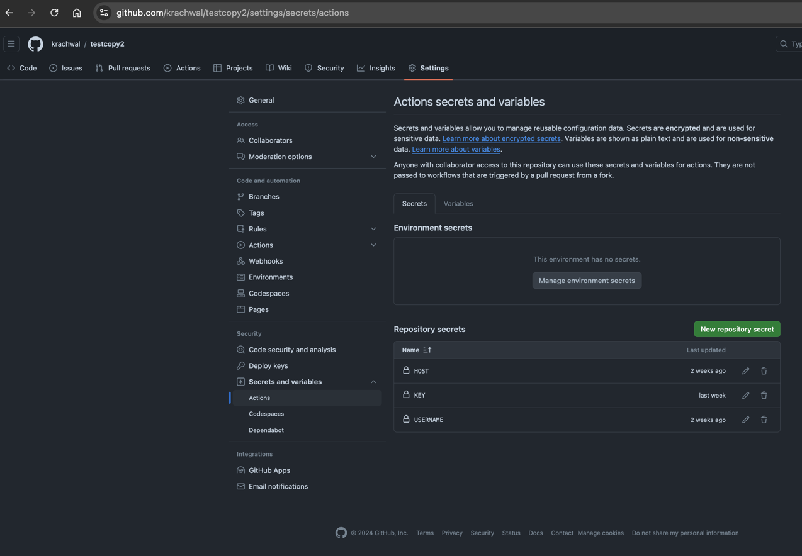

# Provided GitHub Actions for CI/CD

[deploy.yaml](..%2Ftemplate%2F.github%2Fworkflows%2Fdeploy.yaml) attempts to deploy to a generic Linux instance. It expects `apt` as the package manager on that server. 

[deploy_w_docker.yaml](..%2Ftemplate%2F.github%2Fworkflows%2Fdeploy_w_docker.yaml) attempts to deploy to a Linux instance with Docker installed. 

- `HOST` should be the domain name or IP address of the web server.
- `KEY` should be the `ssh` key to connect to the web server.
- `USERNAME` should be the username of the `ssh` user. This user will own the server process.

For detailed documentation on GitHub Actions workflows refer to [the official documentation](https://docs.github.com/en/actions/writing-workflows).